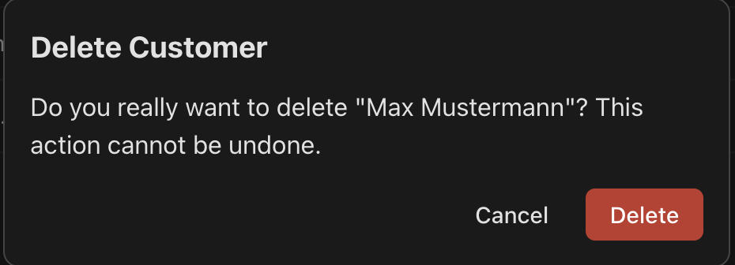

Title: Delete customer from list and details views
Date: 2026-04-26
Author: OpenCode Assistant <assistant@openai.com>

Summary
-------
Enable users to delete an existing customer from both existing entry points: the customers table and the customer details (edit) page. The deletion flow must be safe (explicit confirmation), consistent with current API/UI patterns, and testable end-to-end across frontend and backend modules.

Feature Size Check & Slice
--------------------------
This request is **small-to-medium** and can fit in one feature specification, but implementation should be split into two delivery slices:
1. **Slice A (Backend API):** add DELETE endpoint, service/repository deletion logic, and integration tests.
2. **Slice B (Frontend UX):** add delete actions + confirmation dialog in table and details views, wire mutation/error handling, and UI tests.

Who (Actors / Roles)
--------------------
- **Admin user (primary actor):** manages customer records in the web app and can delete customers.
- **Customer record (subject):** the entity being deleted.
- **System (frontend + backend):** confirms intent, executes deletion, refreshes UI state, and reports failures.

What (Functional Requirements)
------------------------------
1. The admin can initiate customer deletion from the **customers table/list view**.
2. The admin can initiate customer deletion from the **customer details/edit view**.
3. Both entry points require an explicit confirmation step before deletion is executed.
4. On successful deletion, the deleted customer is no longer retrievable and no longer visible in the list.
5. Failure responses are handled with user-visible, non-technical error feedback consistent with current error handling style.

How (Behavior, UX, API, Data, Errors, Non-Functional)
------------------------------------------------------

### API & Backend behavior
- Add endpoint: `DELETE /api/customers/{id}`.
- Success response: `204 No Content`.
- Unknown ID response: `404 Not Found` with message `Customer not found` (same wording convention as GET/PUT by id).
- Authorization: no additional role checks introduced in this ticket (assume existing app security context applies; currently no explicit auth model in this module).
- Data behavior: hard delete of customer row (no soft delete/versioning requirements in scope).

### Frontend data/mutation behavior
- Add client API method for delete in `customerApi` and React Query mutation hook in `customerQueries`.
- Use **pessimistic update** (no immediate optimistic row removal):
  - Execute deletion request after confirmation.
  - On success invalidate customer list query and relevant detail query.
- If deletion originates from details page and succeeds, navigate to `/customers`.
- If deletion originates from list page and succeeds, remain on list and refresh table data.

### UX behavior
- Entry point A (list view): Add a `Delete` button in each row action group next to existing `Edit`.
- Entry point B (details view): Add a `Delete` button in header/action area.
- Clicking `Delete` opens confirmation dialog with:
  - title: `Delete customer?`
  - body text including customer identifier (full name and/or email)
  - actions: `Cancel` (secondary), `Delete` (danger)
- During pending deletion request:
  - disable dialog actions to prevent duplicate submit
  - show progress label on confirm action (e.g., `Deleting...`)
- On failure:
  - keep user on current page
  - close nothing automatically until response is known
  - show inline error banner using existing `.error-message` styling/message area

### Edge cases
- **Already deleted / not found (404):** show `Customer not found` error; on details page, provide back navigation to list; no crash.
- **Network failure / timeout:** show generic delete failure message (e.g., `Customer could not be deleted`), keep item visible, allow retry.
- **Double click / repeated submit:** only one request is sent while pending.
- **Deletion from filtered/paginated table:** after successful refresh, list state remains valid and deleted row is absent.

### UI / Screens
Stateful mock (desktop/table view):

```text
Customers
+--------------------------------------------------------------------------------+
| Search: [Max________________]                                                  |
|--------------------------------------------------------------------------------|
| First Name | Last Name | Email            | Phone     | Birth Date | Actions  |
| Max        | Mustermann| max@example.com  | -         | 1990-05-15 | [Edit][Delete] |
| Erika      | Musterfrau| erika@example.com| +49 ...   | -          | [Edit][Delete] |
+--------------------------------------------------------------------------------+
```


On click [Delete] for Max -> modal/dialog opens:



Stateful mock (details/edit view):

```text
Edit Customer                                  [Back] [Delete]
[error banner if needed]
<existing customer form>
```

Accessibility & mobile notes:
- Confirmation dialog must be keyboard operable (focus trapped in dialog while open; `Esc` closes when not pending).
- Initial focus goes to least destructive action (`Cancel`) or dialog title per current dialog implementation approach.
- Buttons must have clear text labels (`Delete`, `Cancel`) and sufficient contrast using existing `.btn-danger` styles.
- On narrow screens, row actions may wrap; keep both `Edit` and `Delete` reachable without horizontal clipping.

Use Cases
---------
- Title: Delete customer from customers table
- Goal: Admin removes an obsolete customer directly from list context
- Pre-conditions: Admin is on `/customers`, customer exists in table
- Steps: 1. Click row `Delete`; 2. Review confirmation dialog; 3. Click `Delete`
- Expected result: Customer is deleted, table refreshes, row is no longer visible

- Title: Delete customer from customer details view
- Goal: Admin removes a customer while reviewing/editing details
- Pre-conditions: Admin is on `/customers/{id}`, customer exists
- Steps: 1. Click page `Delete`; 2. Confirm deletion; 3. Wait for completion
- Expected result: Customer is deleted and admin is navigated back to `/customers` where row is absent

Acceptance Criteria & Tests
---------------------------
- AC-1: Given an existing customer in the list, when the admin confirms deletion from table row action, then backend returns 204 and the row disappears after query refresh.
- AC-2: Given an existing customer details page, when the admin confirms deletion from details action, then backend returns 204 and UI navigates to `/customers` without the deleted customer.
- AC-3: Given delete confirmation dialog is open, when admin clicks `Cancel`, then no delete request is sent and UI remains unchanged.
- AC-4: Given delete request is in progress, when admin tries to re-trigger delete, then duplicate submission is prevented until request resolves.
- AC-5: Given customer does not exist (404), when admin confirms delete, then UI shows a user-facing error and does not crash.
- AC-6: Given network failure during delete, when request fails, then UI shows `Customer could not be deleted` style error and allows retry.
- AC-7: Backend integration tests verify DELETE existing customer -> 204 and subsequent GET -> 404.
- AC-8: Backend integration tests verify DELETE unknown customer -> 404 with `Customer not found` message.

Non-Goals / Out of Scope
------------------------
- Bulk delete (multiple customers in one action).
- Undo/restore, soft-delete, or recycle-bin behavior.
- Changes to authentication/authorization model beyond existing assumptions.
- Audit logging and deletion analytics.
